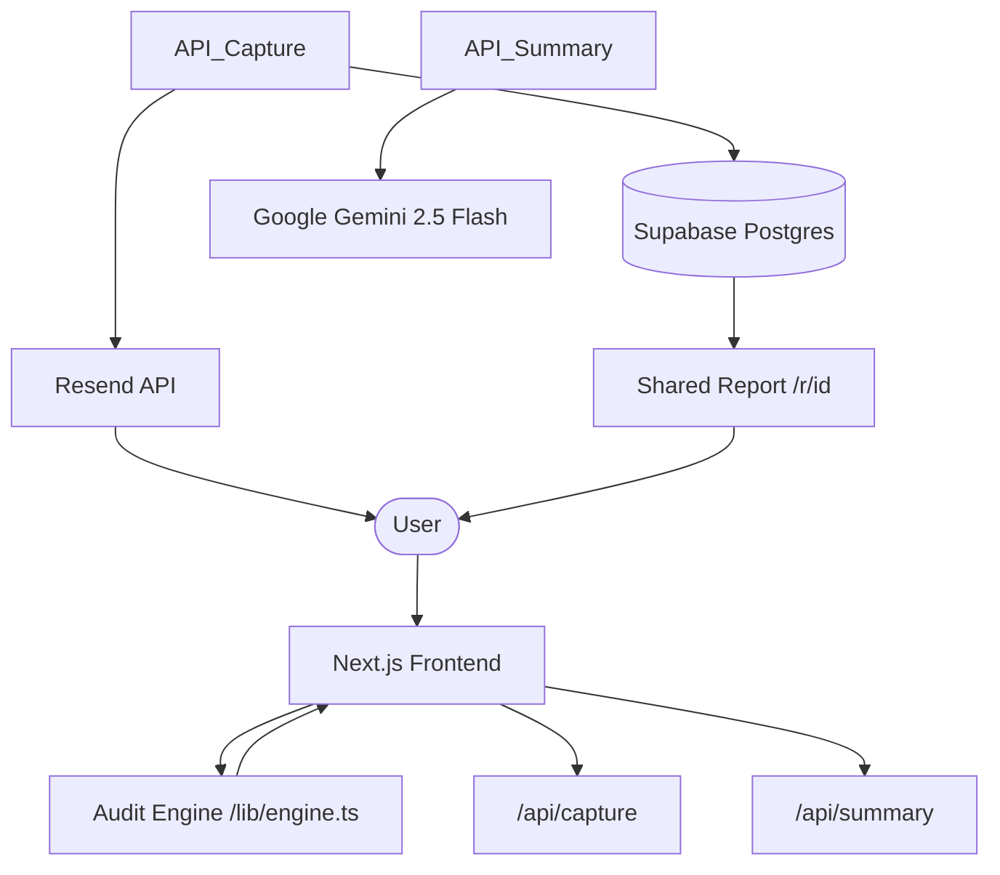

# Architecture

## System Diagram

## Data Flow: From Input to Audit

Lumen operates on a "Math-First, AI-Second" architecture to ensure zero latency and 100% accuracy:

1.  **Reactive Input:** As users fill out the `SpendForm`, the state is managed via a React Reducer.
2.  **Deterministic Engine:** Every keystroke triggers the `engine.ts` audit logic. Since pricing is hard-coded into the engine, we achieve sub-millisecond calculation speed without network round-trips.
3.  **Secure Persistence:** When the user clicks "Save," the data is POSTed to `/api/capture`, which validates the payload, checks for bots via a silent honeypot, and persists the lead to **Supabase**.
4.  **AI Enrichment:** Simultaneously, `/api/summary` sends the audit findings to **Google Gemini**. The AI analyzes the specific tool combinations to generate a unique, non-generic executive summary.
5.  **Viral Delivery:** Finally, **Resend** sends a transactional email containing a unique link to the public report (`/r/[id]`), enabling the viral loop.

## Why This Stack?

-   **Next.js (App Router):** Chosen for its superior SEO capabilities and the ability to colocate serverless API routes with high-performance UI components.
-   **Supabase:** Provided a production-ready PostgreSQL database with zero infrastructure management, allowing us to move from prototype to production in days.
-   **Gemini 2.5 Flash:** Selected for its extremely low latency and reasoning capabilities, which allow it to analyze complex SaaS spend patterns and generate strategic advice while maintaining high performance.
-   **Resend:** The modern standard for transactional email, chosen for its developer-friendly API and reliable deliverability into primary inboxes.

## Scaling Strategy (10k+ Audits/Day)

While the current MVP is highly performant, scaling to 10k audits/day would require the following evolutions:

1.  **Edge Rate Limiting:** Implement **Upstash Redis** at the Next.js Middleware layer. This blocks malicious scrapers at the edge before they can consume serverless execution time or DB connections.
2.  **Asynchronous Summaries:** Currently, the AI summary is generated synchronously. At scale, we would move this to a background job (e.g., **Inngest**). The user would see the math immediately, and the AI summary would stream in via Server-Sent Events (SSE).
3.  **Result Caching:** Viral shared reports (`/r/[id]`) should be cached using **Next.js Data Cache** or a CDN. This prevents the database from being hammered by redundant read requests during high-traffic spikes.
4.  **Connection Pooling:** As PostgreSQL connections scale, we would introduce **Supabase Connection Pooling** (PgBouncer) to prevent the "too many clients" error common in serverless environments.