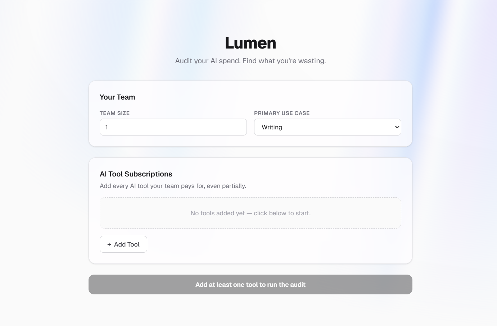
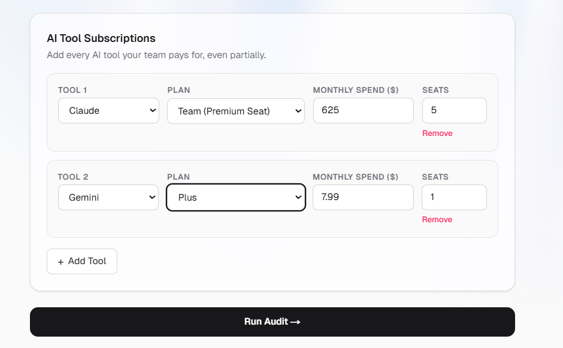
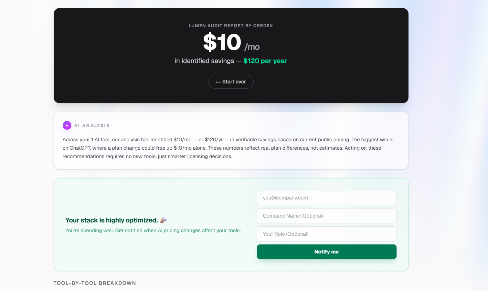
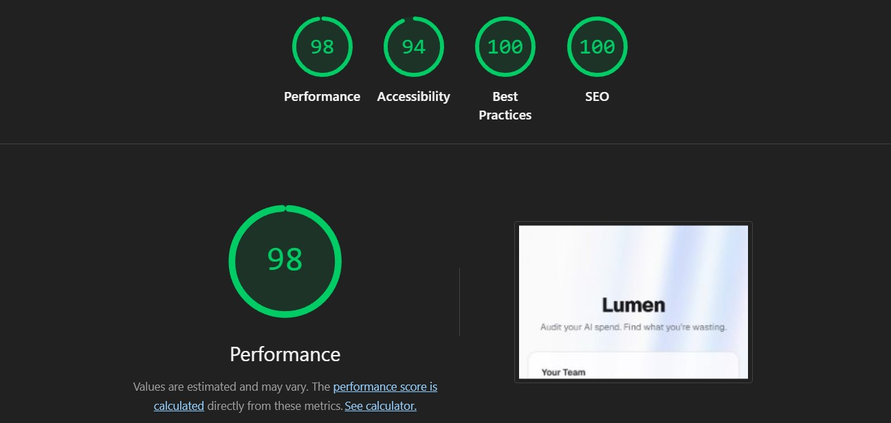

# Lumen

> **Live Demo:** [https://lumenaudit.vercel.app](https://lumenaudit.vercel.app)

Lumen is an AI spend intelligence engine designed for startup founders and engineering managers. It helps teams audit their current AI tool stack (ChatGPT, Claude, Cursor, etc.), identify costly overlaps, and generate a mathematically defensible consolidation plan to save thousands in monthly SaaS spend.

## 🖼️ Screenshots

<div align="center">
  <p align="center"><strong>Lumen Landing Page</strong></p>
  
  <br/><br/>
  <p align="center"><strong>Dynamic Tool Selection</strong></p>
  
  <br/><br/>
  <p align="center"><strong>AI-Powered Savings Report</strong></p>
  
  <br/><br/>
  <p align="center"><strong>Lighthouse Performance Scores</strong></p>
  
</div>

## 🚀 Quick Start

### 1. Prerequisites
You will need API keys for the following services:
- **Supabase:** For lead storage.
- **Google Gemini:** For AI-powered audit summaries.
- **Resend:** For transactional email delivery.

### 2. Setup
Clone the repository and install dependencies:
```bash
git clone https://github.com/AryanSharma48/Lumen.git
cd Lumen
npm install
```

### 3. Environment Variables
Copy the example file and fill in your keys:
```bash
cp .env.example .env.local
```

### 4. Run Locally
```bash
npm run dev
```
Open [http://localhost:3000](http://localhost:3000) to see your app.

### 5. Deploy
The easiest way to deploy this application is via Vercel. 
Ensure your project is pushed to a GitHub repository, then:
1. Import the repository into your Vercel dashboard.
2. Add the required environment variables (`SUPABASE_URL`, `SUPABASE_SERVICE_ROLE_KEY`, `GEMINI_API_KEY`, `RESEND_API_KEY`,`NEXT_PUBLIC_APP_URL`).
3. Click **Deploy**. Vercel will automatically detect the Next.js framework and handle the build.

## 🏗️ Technical Decisions

| Decision | Trade-off | Rationale |
| :--- | :--- | :--- |
| **App Router** | Over SSR/CSR | Leveraged Next.js 15 App Router to achieve a high-performance, SEO-optimized viral loop for shared reports. |
| **Hard-coded Engine** | Over DB Pricing | Chose hard-coded pricing logic for sub-millisecond audit calculations and 100% deterministic results without DB latency. |
| **Honeypot Protection** | Over Captcha | Implemented a silent `_hp` field for bot protection. This ensures a zero-friction UX for leads while preventing automated spam. |
| **React Reducers** | Over Global State | Used `useReducer` for the 12-column spend form to keep complex state co-located and avoid the overhead of libraries like Redux/Zustand. |
| **Resend Integration** | Over SMTP | Integrated Resend for transactional emails to ensure high deliverability and easy management of dynamic HTML audit summaries. |

## 🛠️ Built With
- **Framework:** Next.js (TypeScript)
- **Styling:** Tailwind CSS + Framer Motion
- **Database:** Supabase (PostgreSQL)
- **Email:** Resend
- **AI Engine:** Gemini

---
© 2026 Lumen. Designed for the AI-first workforce.
